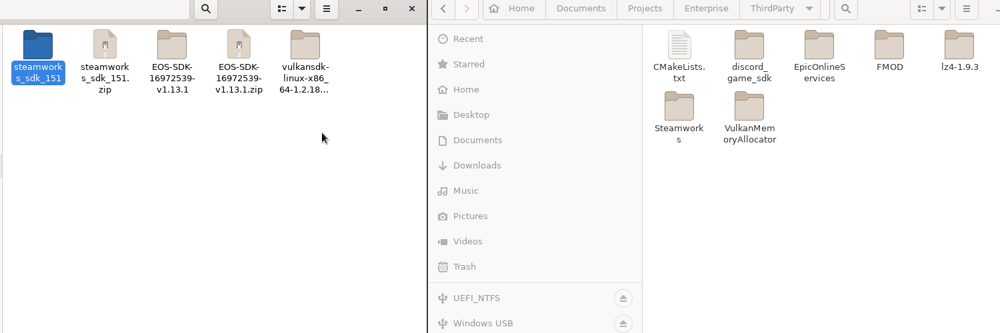

[](https://github.com/cullvox/Enterprise/actions/workflows/c-cpp.yml)


## Why use Enterprise
* Enterprise is a simple game creation library. 
* Its written in standard ISO C99 and perfect for cross platform gameplay.
* We have high security standards, there are replacement functions for many unsafe or banned functions.
* Enterprise either uses, or has the same features as many other libraries for C.

## Building
Enterprise requires an **ISO/IEC 9899:1999** (C99) capable compiler. 

### Dependencies
#### Linux
* All SDL2 dependencies

#### Windows

#### All Operating Systems
* ##### Vulkan SDK
    You can find the Vulkan SDK for your system at https://vulkan.lunarg.com/.

* ##### Steamworks
    Enterprise cannot include this Third-Party library and you must provide it. You can get it at https://partner.steamgames.com/doc/sdk.
    If you wish to use the it you must copy the SDK into **"ThirdParty\Steamworks"** folder.
* ##### Epic Online Services
    Enterprise cannot include this Third-Party library and you must provide it. You can get it at https://dev.epicgames.com/portal/en-US/sdk, ensure you get the **C SDK** version.
    If you wish to use it you must copy the SDK into the **"ThirdParty/EpicOnlineServices"** folder.



## Configuration
Use **CMake** to configure Enterprise to your hearts content. You can enable/disable many RenderAPI, OnlineServices and many more options to compile your game for that system.

###### Options
```c
(NAME = DEFAULT VALUE)
ENTERPRISE_STEAMWORKS_ENABLED = OFF /* Enables steam integration */
ENTERPRISE_STEAMWORKS_PATH = "${ENTERPRISE_DIR}/ThirdParty/Steamworks/sdk")
ENTERPRISE_STEAMWORKS_LIBRARY_PATH = "${ENTERPRISE_STEAMWORKS_PATH}/redistributable_bin")
ENTERPRISE_STEAMWORKS_INCLUDE_PATH = "${ENTERPRISE_STEAMWORKS_PATH}/public")
ENTERPRISE_EPIC_GAMES_ENABLED = OFF /* Enables Epic Online Services entegration */
ENTERPRISE_EPIC_GAMES_PATH =  "${ENTERPRISE_DIR}/ThirdParty/EpicOnlineServices/SDK"
ENTERPRISE_EPIC_GAMES_LIBRARY_PATH = "${ENTERPRISE_EPIC_GAMES_PATH}/Lib"
ENTERPRISE_EPIC_GAMES_INCLUDE_PATH = "${ENTERPRISE_EPIC_GAMES_PATH}/Include"
ENTERPRISE_EPIC_GAMES_PRODUCT_ID = "" /* To get your game on EOS these are required! */
ENTERPRISE_EPIC_GAMES_SANDBOX_ID = ""
ENTERPRISE_EPIC_GAMES_DEPLOYMENT_ID = ""
ENTERPRISE_DISCORD_ENABLED = OFF /* Enables Discord integration */
ENTERPRISE_DISCORD_PATH = "${ENTERPRISE_DIR}/ThirdParty/discord_game_sdk"
ENTERPRISE_DISCORD_LIBRARY_PATH = "${ENTERPRISE_DISCORD_PATH}/lib/x86_64"
ENTERPRISE_DISCORD_INCLUDE_PATH = "${ENTERPRISE_DISCORD_PATH}/c"
```

## Tasks
- [X] Complete Config Parser
- [X] Complete Argument Parser
- [X] Complete Asset Manager
- [ ] Complete Vulkan Implementation
- [ ] Complete Audio Manager
- [ ] Complete Steam Online Service
- [ ] Complete EOS Online Service
- [ ] Complete Entity Component System
- [ ] Complete Default Components
- [ ] Complete Default Systems
- [ ] Complete Voxel World Implementation

###### Optional
- [ ] Complete DirectX 12 Implementation
- [ ] Complete Xbox Live Online Service
- [ ] Complete GNM (Playstation Render API) Implementation
- [ ] Complete PSN Online Service

## Commits
If you wish to commit to Enterprise, that is great! Feel free to make pull requests, issues and whatever else. The only ask that I have is that you make sure you read [STYLE.md](STYLE.md) and ensure that your code complies with the rest of the project.

## License
No license yet.